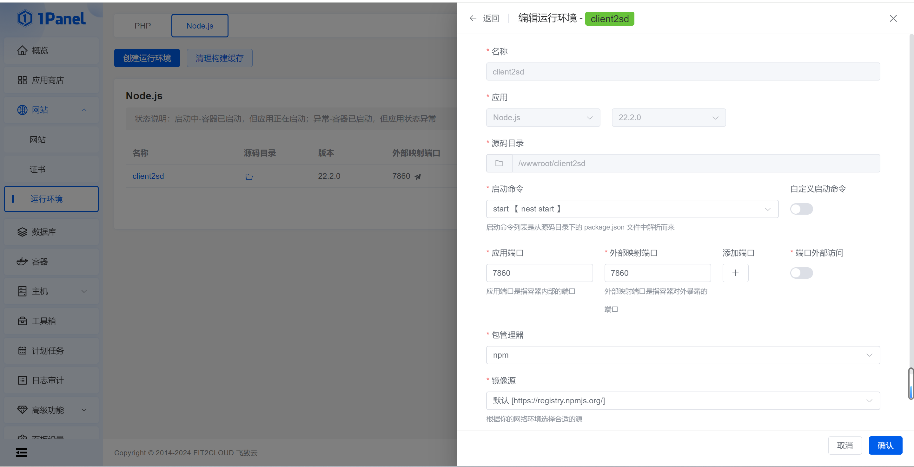
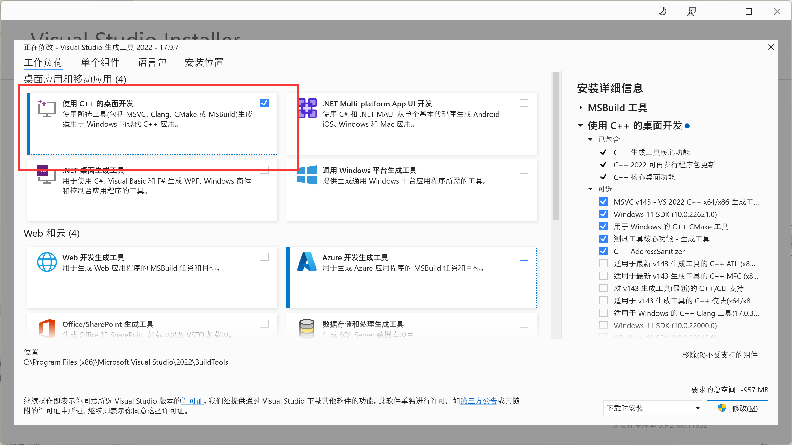

# 免费 sd 画图

无鉴图版本切换`op`分支

用于对接土块画图或者koishi的novelai

## 说明

1、基于`https://huggingface.co/spaces/zugas/fast-stable-diffusion`

2、调用地址：`https://zugas-fast-stable-diffusion.hf.space/`

3、模型修改和鉴图修改,请修改`.env`

## 1panel 运行

可以按照如图方式运行

如果koishi也是1panel创建的,novelai网址可以填 `http://client2sd:7860`



## docker 运行 (推荐)

1、编译镜像

```sh
docker build -t client2sd .
```

2、运行容器

```sh
docker run --restart=always -d -p 7860:7860 -v ./.env:/app/.env --name client2sd client2sd
```

## windows 运行

### 必要环境

1、安装python 3.6以上到3.12以下的版本

2、安装vs2022

vs2022下载地址：https://visualstudio.microsoft.com/zh-hans/visual-cpp-build-tools/

选择 `使用C++的桌面开发` ,然后点击安装



### 安装

```sh
npm i && npm run build
```

### 运行

```
npm run start:prod
```
